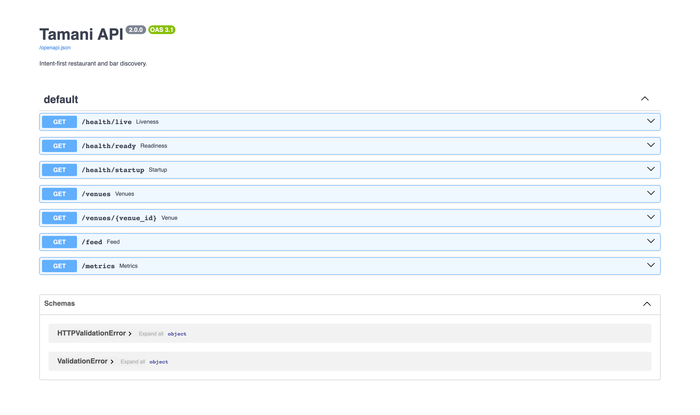
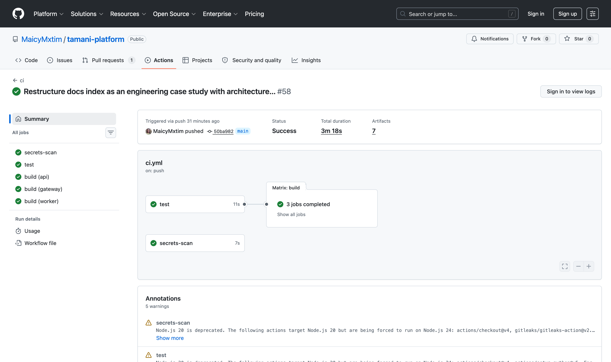
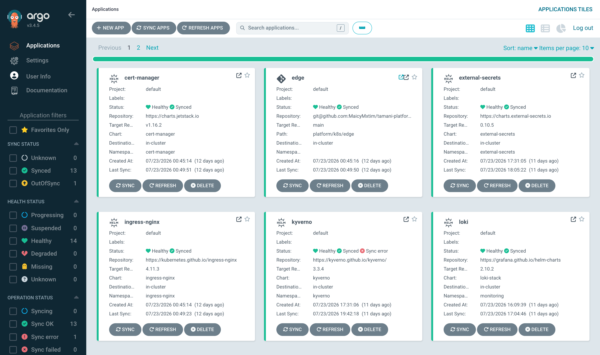
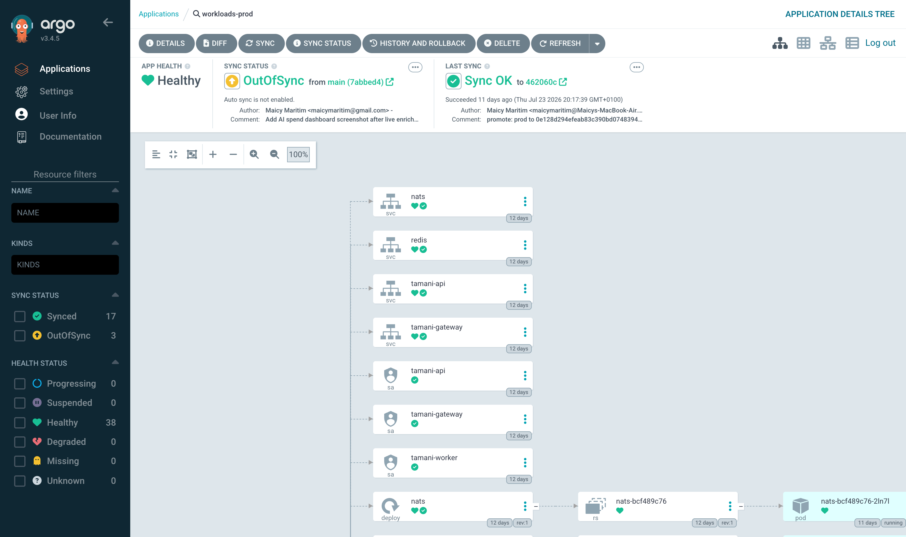
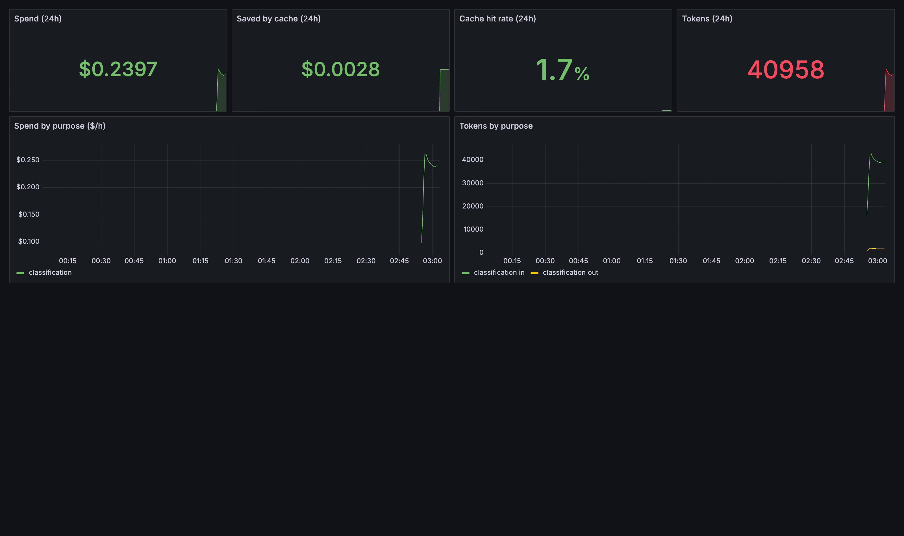
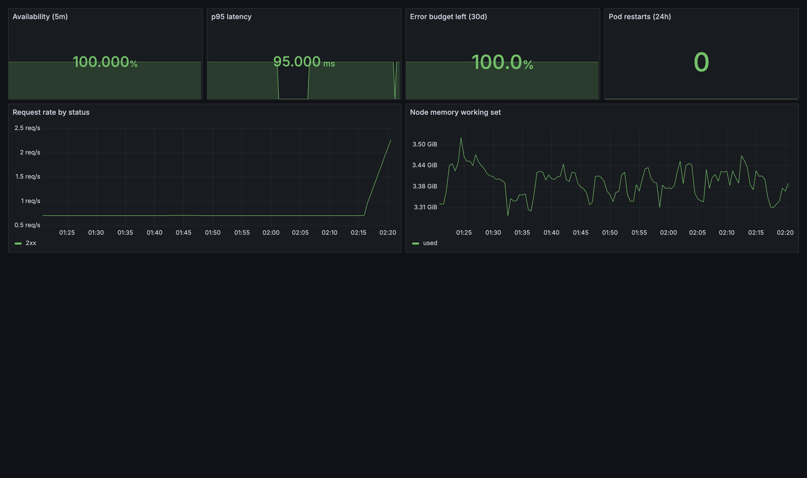

# Tamani Platform

Tamani is an internal developer platform on AWS. It runs a real venue discovery backend on Kubernetes and delivers every change through GitOps: applications arrive signed, admission policy checks them, and monitoring covers them from their first request. Every AI call goes through a governed gateway, two autonomous agents operate inside a safety layer, and the whole system is live on the public internet.

## Executive summary

| | |
|---|---|
| **Problem** | An AI-backed product needs safe deployment, visible AI spend and secure operations, with a small team and a small budget. |
| **Solution** | A Kubernetes platform delivered by GitOps, with a governed AI gateway, governed autonomous agents, full observability and a signed supply chain. |
| **Stack** | AWS · OpenTofu · k3s · Argo CD · GitHub Actions · Kyverno · NATS · FastAPI · Prometheus · Grafana · Loki |
| **Scale** | One 2&nbsp;GB cloud node serving a catalogue of 1,275 venues. |
| **Live** | [platform.waypear.com](https://platform.waypear.com/) · [API explorer](https://platform.waypear.com/docs) |
| **Source** | [github.com/MaicyMxtim/tamani-platform](https://github.com/MaicyMxtim/tamani-platform) |

Key outcomes:

- 100% availability and 95&nbsp;ms p95 latency in the measured window, against targets of 99.5% and 400&nbsp;ms.
- $4.01 per thousand AI classifications after caching, with a measured route to about $1.77 through model tiering.
- A new service goes from one scaffold command to serving live traffic in 195 seconds.
- Every image is signed, scanned and shipped with an SBOM, and the cluster admits signed images only.



*The live API at [platform.waypear.com/docs](https://platform.waypear.com/docs), with split liveness, readiness and startup probes exposed alongside the product endpoints.*

## The problem

The workload is a venue discovery backend. Users search and browse venues, and an AI model classifies each venue's vibe and attributes from its description.

The obvious way to build this is a service that calls the AI provider directly and gets deployed by hand. That approach breaks down quickly. AI spend is invisible until the bill arrives, every service holding the provider key widens the attack surface, and manual deployment makes each release a risk. The platform exists to fix those three things at once: deployment is automated and verifiable, every AI call is governed and accounted for, and the whole system can be observed and rebuilt from the repository.

The constraints shaped the design. The budget covers one 2&nbsp;GB cloud node, and one person builds and operates everything. Every component had to earn its memory footprint.

## Architecture

<svg viewBox="0 0 780 470" xmlns="http://www.w3.org/2000/svg" role="img" aria-label="Tamani Platform architecture diagram" style="width:100%;height:auto;background:#fafafa;border:1px solid #e1e4e8;border-radius:8px;margin:8px 0 16px">
<style>
.tg-box{fill:#ffffff;stroke:#c6cbd1;stroke-width:1}
.tg-boxa{fill:#e6f2ee;stroke:#1f6f5c;stroke-width:1}
.tg-zone{fill:none;stroke:#959da5;stroke-width:1;stroke-dasharray:5 4}
.tg-t{font-family:SFMono-Regular,Consolas,monospace;font-size:11.5px;fill:#24292e}
.tg-s{font-family:SFMono-Regular,Consolas,monospace;font-size:10px;fill:#6a737d}
.tg-a{font-family:SFMono-Regular,Consolas,monospace;font-size:11px;fill:#1f6f5c}
.tg-line{stroke:#6a737d;stroke-width:1.2;fill:none}
</style>
<defs>
<marker id="tarr" viewBox="0 0 10 10" refX="9" refY="5" markerWidth="7" markerHeight="7" orient="auto-start-reverse">
<path d="M 0 0 L 10 5 L 0 10 z" fill="#6a737d"/>
</marker>
</defs>
<rect x="20" y="44" width="160" height="36" rx="8" class="tg-box"/>
<text x="100" y="66" text-anchor="middle" class="tg-t">GitHub · main</text>
<line x1="100" y1="80" x2="100" y2="102" class="tg-line" marker-end="url(#tarr)"/>
<rect x="20" y="104" width="160" height="52" rx="8" class="tg-box"/>
<text x="100" y="126" text-anchor="middle" class="tg-t">GitHub Actions</text>
<text x="100" y="143" text-anchor="middle" class="tg-s">test · scan · SBOM · sign</text>
<line x1="100" y1="156" x2="100" y2="178" class="tg-line" marker-end="url(#tarr)"/>
<rect x="20" y="180" width="160" height="36" rx="8" class="tg-boxa"/>
<text x="100" y="202" text-anchor="middle" class="tg-a">Argo CD</text>
<line x1="180" y1="198" x2="218" y2="198" class="tg-line" marker-end="url(#tarr)"/>
<rect x="249" y="20" width="140" height="32" rx="8" class="tg-box"/>
<text x="319" y="40" text-anchor="middle" class="tg-t">Internet</text>
<line x1="319" y1="52" x2="319" y2="98" class="tg-line" marker-end="url(#tarr)"/>
<rect x="220" y="86" width="540" height="316" rx="12" class="tg-zone"/>
<text x="740" y="110" text-anchor="end" class="tg-s">k3s on AWS · state reconciled from Git</text>
<rect x="244" y="100" width="150" height="36" rx="8" class="tg-box"/>
<text x="319" y="122" text-anchor="middle" class="tg-t">ingress · TLS</text>
<line x1="319" y1="136" x2="319" y2="168" class="tg-line" marker-end="url(#tarr)"/>
<rect x="244" y="170" width="150" height="48" rx="8" class="tg-box"/>
<text x="319" y="190" text-anchor="middle" class="tg-t">venue API</text>
<text x="319" y="206" text-anchor="middle" class="tg-s">FastAPI</text>
<rect x="414" y="170" width="170" height="48" rx="8" class="tg-boxa"/>
<text x="499" y="190" text-anchor="middle" class="tg-a">AI gateway</text>
<text x="499" y="206" text-anchor="middle" class="tg-s">budgets · cache · ledger</text>
<rect x="604" y="170" width="140" height="48" rx="8" class="tg-box"/>
<text x="674" y="190" text-anchor="middle" class="tg-t">agents</text>
<text x="674" y="206" text-anchor="middle" class="tg-s">governed runtime</text>
<line x1="604" y1="194" x2="586" y2="194" class="tg-line" marker-end="url(#tarr)"/>
<line x1="319" y1="218" x2="319" y2="244" class="tg-line" marker-end="url(#tarr)"/>
<line x1="499" y1="218" x2="509" y2="244" class="tg-line" marker-end="url(#tarr)"/>
<rect x="244" y="246" width="170" height="48" rx="8" class="tg-box"/>
<text x="329" y="266" text-anchor="middle" class="tg-t">NATS JetStream</text>
<text x="329" y="282" text-anchor="middle" class="tg-s">events · retries · DLQ</text>
<rect x="444" y="246" width="140" height="48" rx="8" class="tg-box"/>
<text x="514" y="266" text-anchor="middle" class="tg-t">Redis</text>
<text x="514" y="282" text-anchor="middle" class="tg-s">queue · cache</text>
<rect x="244" y="330" width="250" height="44" rx="8" class="tg-box"/>
<text x="369" y="349" text-anchor="middle" class="tg-t">Prometheus · Grafana · Loki</text>
<text x="369" y="365" text-anchor="middle" class="tg-s">SLOs · burn-rate alerts</text>
<rect x="514" y="330" width="230" height="44" rx="8" class="tg-boxa"/>
<text x="629" y="349" text-anchor="middle" class="tg-a">Kyverno admission</text>
<text x="629" y="365" text-anchor="middle" class="tg-s">signed images only</text>
<rect x="220" y="418" width="540" height="34" rx="8" class="tg-box"/>
<text x="490" y="439" text-anchor="middle" class="tg-s">AWS · EC2 · Route 53 · S3 · SSM Parameter Store · IAM</text>
</svg>

The system is organised in tiers.

- **Edge.** ingress-nginx terminates TLS with certificates issued automatically by cert-manager, and applies a first-line rate limit.
- **Application.** The venue API serves search and the public feed. The inference gateway owns every call to the AI provider. A worker pool consumes background jobs.
- **Agents.** An enrichment agent classifies venues and an operations agent triages alerts, both inside a shared governance runtime.
- **Messaging.** NATS JetStream carries events between services, so work that can wait happens asynchronously.
- **Data.** Redis provides the job queue, the semantic cache and the rate limiter. A bundled snapshot serves venue reads.
- **Platform.** k3s on one AWS node, reconciled from Git by Argo CD, observed by Prometheus, Grafana and Loki, with Kyverno enforcing admission policy and External Secrets Operator supplying secrets.

## How a change reaches production

```
developer commits to GitHub
        │
GitHub Actions      tests · image build · trivy scan · SBOM · gitleaks · cosign signature
        │
container registry  image + signature + SBOM
        │
Argo CD             platform config syncs automatically
        │           production workloads are pinned to a commit and synced deliberately
Kyverno             admission check verifies the image signature
        │
running service
```

Every change flows through Git, so the cluster's state is reviewable, auditable and rebuildable. The cluster rejects any image that was signed by anything other than this repository's CI.



*A real CI run: a secrets scan, the test suite, then parallel builds of the API, gateway and worker images. The run produced seven artifacts, including an SBOM for each image.*



*Argo CD manages the platform as fourteen applications, from cert-manager and ingress through Kyverno, Loki and the workloads themselves. Thirteen sync automatically from Git.*



*The fourteenth is production. `workloads-prod` is Healthy but shows OutOfSync with auto-sync disabled, because production is pinned to an exact promoted commit and moves only when a person syncs it. The last sync records the promotion commit it shipped.*

## Design decisions

**NATS JetStream over Kafka and Redis Streams.** The event backbone needs durable delivery, consumer groups, replay and dead-lettering, at a peak volume of a few thousand messages a day on a 2&nbsp;GB node. Kafka wants gigabytes of memory and solves scale problems this workload will never have. Redis Streams would couple the cache and the system of record into one failure domain. JetStream is a single 15&nbsp;MB binary that provides all four requirements. The cost is at-least-once delivery, which is handled with idempotency keys in every consumer. The full reasoning is in [ADR&nbsp;0002](https://github.com/MaicyMxtim/tamani-platform/blob/main/docs/adr/0002-nats-jetstream-over-kafka-and-redis-streams.md).

**One k3s node over a managed cluster.** The budget covers a single small machine, and k3s runs a complete, conformant Kubernetes within it. Every practice on top, GitOps, admission policy, observability, SLOs, transfers directly to a managed cluster, and the publish and consume seams keep that migration contained.

**GitOps with Argo CD.** The cluster was rebuilt from the repository during development, and drift between Git and the cluster shows up in the Argo CD dashboard. Deployment becomes a reviewed pull request.

**A gateway owning every AI call.** One service holds the provider key, which gives one place to enforce budgets, cache responses, version prompts and record cost. Details are in the next section.

**Loki over a full-text log stack.** Loki indexes labels rather than log content, which keeps its memory footprint small enough to share a 2&nbsp;GB node with everything else, and label queries cover the debugging this platform needs.

## The AI gateway

Every AI call in the system goes through one service, and that service is the only holder of the provider key. The gateway enforces:

- **Per-tenant token budgets**, so a runaway caller is cut off before the bill grows.
- **A semantic cache** at a 0.94 similarity threshold. In the measured window it saved 22% of spend, and the saving rises with traffic because popular venues repeat.
- **Structured output**, so responses are validated against a schema before anything downstream trusts them.
- **A circuit breaker** with a deterministic fallback when the provider is unavailable.
- **A cost ledger** with one record per request: tenant, model, tokens, cost, cache hit. The unit economics report is built from this ledger.
- **A review queue** for low-confidence classifications, which go to a human reviewer before anything is written.



*The AI spend dashboard after re-enriching 60 venues: 24&nbsp;cents of spend, 40,958 tokens, input and output tokens tracked separately, and every request attributed to a purpose in the cost ledger.*

The [unit economics report](unit-economics.html) measures the options this creates. Running the 144-venue golden set through three models showed that routing straightforward classifications to a small model and escalating the ambiguous ones cuts blended cost by about 57%, for a small and measured accuracy loss. The gateway already records confidence per classification, so enabling this is a configuration change.

## Autonomous agents

Two agents run on the platform, and both operate inside a governance runtime that enforces a capability manifest, token, time and tool-call budgets, loop detection, a dry-run mode and per-call tracing.

The **enrichment agent** classifies venues through the gateway, so its spend is budgeted and logged like any other caller.

The **operations agent** triages alerts. It inspects the cluster with a read-only identity, retrieves the matching runbook, asks the gateway for a diagnosis grounded in the evidence it collected, and opens a pull request with the diagnosis and a proposed fix. A person reviews and merges that pull request, which keeps the agent's write path inside the same Git review flow as every other change.

## Security

- **Supply chain.** CI scans dependencies and images with trivy, checks for leaked secrets with gitleaks, generates an SBOM with syft and signs every image with cosign.
- **Admission control.** Kyverno admits signed images only, and requires pinned tags, resource limits and non-privileged workloads.
- **Secrets.** The provider key lives in AWS SSM Parameter Store. External Secrets Operator syncs it into the cluster with a read-only identity, so the key stays out of Git and out of the images.
- **Least privilege.** The operations agent's Kubernetes identity has read verbs only, and each service sees only the credentials it needs.

## Observability

Prometheus scrapes metrics, Loki collects logs, and Grafana presents two dashboards: service health and AI spend. The service level objectives are 99.5% availability and 400&nbsp;ms p95 latency, with multi-window burn-rate alerts so a fast burn pages and a slow burn opens a ticket. Every alert has a runbook written before the alert ever fired.



*The live service health dashboard: 100% availability, 95&nbsp;ms p95 latency, a full 30-day error budget, zero pod restarts in 24 hours, and request rate against the memory of the single node.*

## Developer self-service

The platform exists so that a developer can ship a service without becoming an infrastructure expert. This is the whole journey:

```
developer runs `tamani new <service>`
        │
scaffold        hardened container · health probes · metrics · network policy
        │       alert rule · runbook · catalogue entry
        │
git push        CI tests, builds, scans and signs the image, and attaches an SBOM
        │
Argo CD         picks up the generated application and deploys it
        │
Kyverno         admits the image because the signature verifies
        │
live            the service is receiving traffic, with its dashboard
                and alert already in place
```

This was measured end to end: 195 seconds from the scaffold command to live traffic, through the same signature policy as every other workload.

## Engineering challenges

**Running a full platform in 2&nbsp;GB of memory.** The budget covered one small node, and a typical platform stack assumes several times that. The response was to make operational weight a selection criterion: k3s instead of a full distribution, NATS JetStream's single 15&nbsp;MB binary as the event backbone, Loki's label-based indexing for logs, and resource limits on every workload so nothing grows unnoticed. The platform fits, and its limit is measured precisely: load testing found saturation at 25 to 30 concurrent users, and the node ran out of memory twice on the way there. Both incidents have [postmortems](https://github.com/MaicyMxtim/tamani-platform/tree/main/runbooks/postmortems), and the [chaos experiments](https://github.com/MaicyMxtim/tamani-platform/tree/main/runbooks/chaos) record how the platform recovers when components are killed.

**Enforcing security without slowing delivery.** Signed images, pinned tags, resource limits and non-privileged workloads are a heavy compliance burden if every service has to meet them by hand. The response was to build compliance into the golden path: the CLI scaffold ships a hardened container, probes, a network policy and a signed pipeline, so a brand-new service passes admission policy by default. The measured result is a service reaching live traffic in 195 seconds without a single policy exception.

**Keeping AI spend visible and bounded.** Inference dominates the marginal cost of this product, and spend through a shared API key is invisible until the bill arrives. The response was to give the provider key to exactly one service and route every call through it, with per-tenant budgets, a semantic cache and a per-request cost ledger. The result is that cost is a number on a dashboard: $4.01 per thousand classifications after caching, a measured 22% cache saving, and a measured 57% further cut available from confidence-based tiering.

## Results

| What was measured | Result |
|---|---|
| Availability of the live service over the measured window, against the 99.5% objective | 100% |
| p95 latency of the live API, against the 400&nbsp;ms objective | 95&nbsp;ms |
| Cost per thousand AI classifications through the gateway, after caching | about $4.01 |
| Further saving from confidence-based model tiering, measured on the golden set | about 57% |
| Classification precision and recall on the 144-venue golden set | 80.3% / 68.0% |
| Time from one scaffold command to a new service taking live traffic | 195 seconds |
| Concurrent users at which the single 2&nbsp;GB node saturates, found by load testing | 25 to 30 |

Classification accuracy is enforced in CI as a regression gate, so a change that makes the model worse fails the build.

## What I would improve

- Add a second node, since memory on the single node sets the saturation point.
- Enable confidence-based model tiering, using the routing data the gateway already records.
- Add distributed tracing alongside the metrics and logs.
- Automate canary analysis for production workloads, which currently ship through a deliberate manual sync.

## Lessons learned

- Operational weight decided most technology choices on a small platform. The lightest option that met every requirement won each time.
- Caching and model tiering cut AI spend by more than half while keeping accuracy measured, which made cost a design input rather than a surprise.
- GitOps made rebuilds and audits cheap, and it moved the hard work into repository design.
- SLOs, postmortems and chaos experiments turned reliability into evidence that can be shown, and they found the platform's real limits before users did.

## Further reading

1. [Walkthrough](walkthrough.html). A component-by-component tour of the finished platform.
2. [Unit economics](unit-economics.html). The measured cost figures and how they were arrived at.
3. [Architecture decision records](https://github.com/MaicyMxtim/tamani-platform/tree/main/docs/adr). The choices and their trade-offs.
4. [Runbooks, postmortems and chaos results](https://github.com/MaicyMxtim/tamani-platform/tree/main/runbooks). The operational record.
